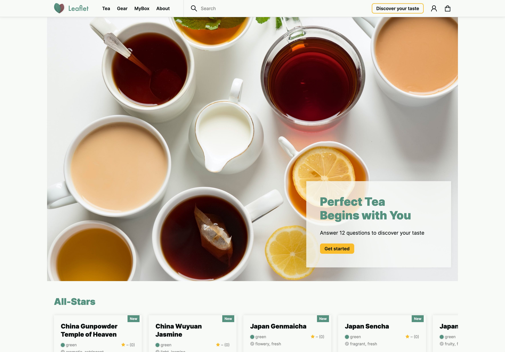

# Leaflet MERN stack prototype

This is a rather large demo prototype of a tea store that quizzes you for your taste.

It is a full-stack MERN monorepo application, written entirely in TypeScript and JavaScript, and [deployed here](https://sweetleaf.vercel.app).

-   The backend is a **Node/Express/Mongoose API server** that also serves the static frontend files. It does **local and Google auth via Passport**,and sends emails through **SendGrid**.
-   The frontend is a **React SPA** that uses **Redux Toolkit** for state management, **React Router**, customized **Ant Design** components, and **Styled Components** for styling.

